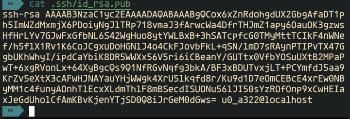

# Pengenalan Git dan Github


----

Aktivitas coding tentu memerlukan penggunaan tools atau aplikasi untuk mewujudkannya. Aktivitas tersebut sangat bergantung pada syntax yang tepat. Dari sekian banyak pemanfaatan teknologi yang tersedia, ada berbagai aplikasi dengan nama serupa, namun sesungguhnya berbeda. Contohnya adalah Java dengan JavaScript, HTML serta CSS, maupun Git dan GitHub. Hal inilah yang menyebabkan kamu harus tahu perbedaan masing-masing tools tersebut.

Git dan GitHub, apakah keduanya adalah hal yang sama? Apabila tidak, apakah masih berhubungan melalui beberapa cara? Atau seperti Java dan JavaScript yang terkait secara terbatas? Pertanyaan-pertanyaan tersebut ternyata juga umum diutarakan khususnya oleh orang-orang yang memiliki minat pada web maupun apps development.

Faktanya Git serta GitHub punya berbagai kesamaan namun juga perbedaan. Kamu dapat menggunakan keduanya untuk mengoptimalkan proses development pada website maupun aplikasi. Keduanya dapat menerima proses integrasi agar dapat dimanfaatkan bersama-sama. Sebenarnya, apa saja perbedaan antara Git dengan GitHub? Baca selengkapnya melalui penjelasan di bawah ini.

## Perbedaan Git dan GitHub yang Harus Kamu Pahami

<details markdown='1'><summary> Bentuk pengoperasian</summary>

----

Perbedaan utama dari Git dengan GitHub terletak pada fungsinya. Persamaan keduanya diantaranya terletak pada penyediaan Source Code Management (SCM) serta sama-sama memudahkan penggabungan dan pembagian kode. Bedanya, Git merupakan open-source software yang dirancang untuk merangkum riwayat sumber dari pengkodean. Tools ini mampu membalikkan perubahan hingga memberikan kesempatan pada seorang developer untuk membagikan kode kepada sesama developer. Kamu harus melakukan instalasi lokal untuk berkolaborasi menggunakan Git. Selain itu, Git punya peran sebagai tools terbaik dan banyak digunakan saat ini.

Di sisi lain, GitHub merupakan layanan hosting berbasis web sebagai repositori Git. GitHub menawarkan seluruh DVCS SCM dan diperkaya dengan beberapa fitur tambahan. Beberapa diantaranya berupa kolaborasi manajemen tiket, manajemen proyek, hingga pelacakan bug. Melalui GitHub, developer dapat membagikan, mengakses, serta menyimpan salinan repositori secara jarak jauh.

----

</details>

<details markdown='1'><summary>Git dan GitHub menangani commands secara berbeda</summary>

----

Developer yang menggunakan Git dapat menggunakan command-line tool, yaitu pengubah kode dan dapat digabungkan menuju perangkat lokal. Sedangkan, GitHub menyediakan interface grafis berbasis cloud sebagai tempat untuk melakukan seluruh tugas. Interface ini juga menawarkan kontrol akses developer, fitur kolaborasi, serta tools lainnya sebagai sarana manajemen pekerjaan kamu saat itu.

Ketika membahas soal commands, Git cenderung fokus pada tugas-tugas SCM yang eksklusif, seperti push and pull, reset, commit, fetch, dan merge. GitHub berfungsi sebagai tuan rumah terhadap repositori Git dalam penyimpanan kode di lokasi yang terpusat. Selain itu, Git menjadi alat yang digunakan untuk mengelola beberapa versi editing dari sumber kode yang ditransfer menuju repositori. GitHub menjadi lokasi akhir dari unggahan salinan repositori git.

----

</details>

<details markdown='1'><summary>Bekerja di lingkungan yang berbeda</summary>

----

Git dan GitHub punya faktor perbedaan lainnya, yaitu tempatnya beroperasi. Git melewati proses instalasi secara lokal pada suatu sistem sehingga developer mampu mengelola riwayat sumber kode menggunakan repositori. Tidak ada server terpusat atau internet yang diperlukan untuk menggunakan Git. Selain itu, tidak ada sistem manajemen pengguna yang tersedia atau desktop GUI yang dimiliki oleh pihak tertentu.

GitHub memerlukan akses internet dan dapat dibuka melalui cloud. Terdapat sistem manajemen pengguna yang sifatnya bawaan dan GUI ramah pengguna. Selain memiliki kemudahan akses melalui situs web, GitHub juga menawarkan versi desktop yang dapat diinstal pada komputer lokal agar lebih fleksibel untuk menyinkronkan kode. Git memang masih bisa dioperasikan tanpa GitHub, namun GitHub tidak bisa digunakan tanpa Git.


----

</details>

Setelah mengenal perbedaan dari Git dan Github selanjutnya kita praktekan cara menggunakan Git dan Github pada perangkat Android

## Cara menggunakan Git dan Github di Android

Selanjutnya kita akan meremote repository pada Github dengan Tools Git pada Android dengan menggunakan aplikasi Termux

### Membuat repository baru pada Github

1. Masuk ke menu **Repository** lalu klik **New**

   

2. Isi nama repository, deskripsi dan kamu bisa mengatur repository nya Publik jika repository kamu ingin dilihat banyak orang, Private untuk diri kamu sendiri.

   
   
   Jika sudah klik **Create Repository**
   
### Remote repository dengan Git

Jika repo telah berhasil di buat selanjutnya kita remote repository tersebut dengan Git pada termux. Yang nantinya kita akan Upload Projek Lokal kita ke repository tersebut. Github menyediakan beberapa metode remote diantaranya remote dengan https, token dan ssh. Sekarang kita akan menggunakan metode ssh, karena menurut saya ini adalah cara yang paling praktis.

1. Install SSH pada termux

   ```
   pkg install openssh -y
   ```
   
   

2. Membuat SSH Key

   ```
   ssh-keygen
   ```
   
   
   
   Disini kamu bisa enter langsung ataupun memberikan password login ssh, namun karena hanya untuk latihan jadi saya langsung enter saja
   
3. Menyalin id ssh publik dan menempelnya pada akun Github kamu

   ```
   cat .ssh/id_rsa.pub
   ```

   Lalu salin kode ssh nya yang nantinya akan di tempel ke akun github kamu
   
    
    
4. Menempelkan ssh key ke akun Github

   Masuk ke settings
   
   
   
   Masuk ke menu SSH
   
   
   
   New ssh key
   
   
   
   Tempel ssh key
   
   
   
   Klik **Add SSH Key**
   
5. Lakukan testing untuk memastikan ssh sudah terhubung
   
   ```
   ssh -T git@github.com
   ```
   lalu ketik yes dan pastikan username github kamu tampil seperti gambar di bawah
   
   
   
### Upload projek ke Repository

Selanjutnya kita mencoba upload projek sederhana ke Repository Github yang telah di buat tadi, kita membutuhkan tools Git untuk melakukannya

1. Install Git
   
   ```
   pkg install git -y
   ```
   
   
2. Clone Repo Github ke lokal

   Salin link repository nya
   
   
   Lalu clone dengan perintah `git https://github.com/alama_reponya`
   
   Contohnya :
   
   ```
   git clone https://github.com/teguhtech/Nama_Repo
   ```
   
   
   
   ketik `ls` untuk memastikan repo sudah berhasil di clone
   
3. Masuk ke folder repo tadi
   
   ```
   cd Nama_Repo/
   ```
   

4. Kita buat projek html sederhana untuk di upload ke repo
   
   ```
   nano index.html
   ```
   
   isi `hello world` saja untuk percobaan
   
   
   
   `CTRL + s`, `CTRL +x`
   
5. Selanjutnya kita akan upload projeknya
   
   verifikasi global email dan name
   
   ```
   git config --global user.email "you@example.com"
   ```
   ```
   git config --global user.name "Your Name"
   ```

   contoh :
   
   
   
   `git checkout -b "nama_branch"` Membuat branch baru
  
   `git add .` adalah perintah yang digunakan untuk menambahkan file baru di repository yang dipilih.
   
   `git commit -m "nama_commit"` digunakan untuk menyimpan perubahan yang sudah dilakukan, namun tidak ada perubahan yang terjadi pada remote repository.
   
   
   
   ```
   git remote add nama-remote git@github.com:teguhtech/Nama_Repo.git
   ```
   
   ----
   
   >    perlu di perhatikan untuk link repo dalam remote ssh dengan https berbeda 

   Perhatikan
   Link repository :
   
   `https://github.com/teguhtech/Nama_Repo`
   
   Remote ssh :
   
   `git@github.com:teguhtech/Nama_Repo.git`
   
   Ubah `https://` menjadi `git@` 
   
   Ubah `github.com/` menjadi `github.com:`
   
   ----
   
   
   ```
   git push nama-remote nama-branch
   ```
   push untuk upload projek
   
   
   
   Maka jika berhasil projek kamu akan berada di repository Github kamu.
   
   
